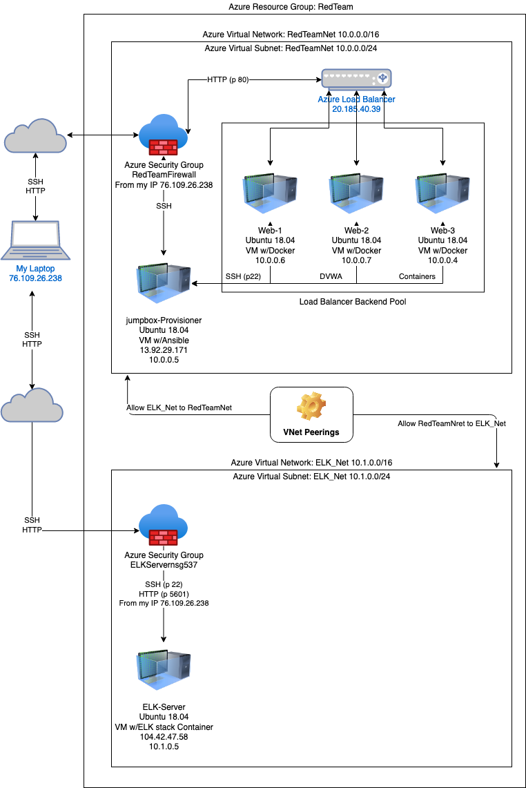
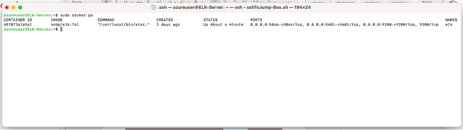
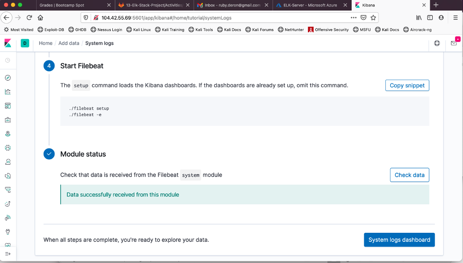

## Automated ELK Stack Deployment

The files in this repository were used to configure the network depicted below.

These files have been tested and used to generate a live ELK deployment on Azure. They can be used to either recreate the entire deployment pictured above. Alternatively, select portions of the playbook file may be used to install only certain pieces of it, such as Filebeat.

  - _---
  - name: installing and launching filebeat
    hosts: elk
    become: yes
    tasks:

    - name: download filebeat deb
      command: curl -L -O https://artifacts.elastic.co/downloads/beats/filebeat/filebeat-7.4.0-amd64.deb

    - name: install filebeat deb
      command: dpkg -i filebeat-7.4.0-amd64.deb

    - name: drop in filebeat.yml
      copy:
        src: /etc/ansible/files/filebeat-config.yml
        dest: /etc/filebeat/filebeat.yml

    - name: enable and configure system module
      command: filebeat modules enable system

    - name: setup filebeat
      command: filebeat setup

    - name: start filebeat service
      command: service filebeat start

This document contains the following details:
- Description of the Topologu
- Access Policies
- ELK Configuration
  - Beats in Use
  - Machines Being Monitored
- How to Use the Ansible Build

### Description of the Topology

The main purpose of this network is to expose a load-balanced and monitored instance of DVWA, the D*mn Vulnerable Web Application.

Load balancing ensures that the application will be highly available, in addition to restricting access to the network.  Load Balancing plays an important security role as computing moves evermore to the cloud. The off-loading function of a load balancer defends an organization against distributed denial-of-service (DDoS) attacks.  The advantage of the jump box is it being a secure computer that all admins first connect to before launching any administrative task or use as an origination point to connect to other servers or untrusted environments.

Integrating an ELK server allows users to easily monitor the vulnerable VMs for changes to the logs and system traffic.
- Filebeat is a lightweight shipper for forwarding and centralizing log data. Installed as an agent on your servers, Filebeat monitors the log files or locations that you specify, collects log events, and forwards them either to Elasticsearch or Logstash for indexing.

- Metricbeat is a lightweight shipper that you can install on your servers to periodically collect metrics from the operating system and from services running on the server. Metricbeat takes the metrics and statistics that it collects and ships them to the output that you specify, such as Elasticsearch or Logstash.

The configuration details of each machine may be found below.
_Note: Use the [Markdown Table Generator](http://www.tablesgenerator.com/markdown_tables) to add/remove values from the table_.

| Name       | Function   | IP Address | Operating System |
|------------|------------|------------|------------------|
| JumpBox-Provisioner   | Gateway    | 10.0.0.5   | Linux            |
| Web-1      | Web Server | 10.0.0.6   | Linux            |
| Web-2      | Web Server | 10.0.0.7   | Linux            |
| Web-3      | Web Server | 10.0.0.4   | Linux            |
| ELK-Server | ELK-Server | 10.1.0.5   | Linux            |

### Access Policies

The machines on the internal network are not exposed to the public Internet. 

Only the JumpBox-Provisioner machine can accept connections from the Internet. Access to this machine is only allowed from the following IP addresses:
- 76.109.26.238

Machines within the network can only be accessed by  JumpBox-Provisioner .
- 76.109.26.238 was allowed access to the ELK VM?

A summary of the access policies in place can be found in the table below.

| Name       | Publicly Accessible | Allowed IP Addresses                              |
|------------|---------------------|---------------------------------------------------|
| Jump Box   | Yes                 | 76.109.26.238 10.0.0.4 10.0.0.6 10.0.0.7 10.1.0.5 |
| Web-1      | No                  | 10.0.0.4 10.0.0.5 10.0.0.7 10.1.0.5               |
| Web-2      | No                  | 10.0.0.4 10.0.0.5 10.0.0.6 10.1.0.5               |
| Web-3      | No                  | 10.0.0.5 10.0.0.6 10.0.0.7 10.1.0.5               |
| ELK-Server | Yes                 | 76.109.26.238 10.0.0.4 10.0.0.5 10.0.0.6 10.0.0.7 |

### Elk Configuration

Ansible was used to automate configuration of the ELK machine. No configuration was performed manually, which is advantageous because...
- The main advantage of instillation with ansible is the fact it's repeatable.
The playbook implements the following tasks:
- install docker.io
- Install pip3
- Install Python Docker Module
- Increase virtual memory
- download and launch a docker web container

The following screenshot displays the result of running `docker ps` after successfully configuring the ELK instance.

### Target Machines & Beats
This ELK server is configured to monitor the following machines:
- 10.0.0.4, 10.0.0.6, 10.0.0.7
We have installed the following Beats on these machines:
- Filebeat System

These Beats allow us to collect the following information from each machine:
- Filebeat
Filebeat is designed to read files from your system. It is particularly useful for system and application log files, but can be used for any text files that you would like to index to Elasticsearch in some way. In the logging case, it helps centralize logs and files in an efficient manner by reading from your various servers and VMs, then shipping to a central Logstash or Elasticsearch instance. Additionally, Filebeat eases the configuration process by including “modules” for grabbing common log file formats from MySQL, Apache, NGINX and more. These modules reduce the Filebeat configuration to a single command.

Metricbeat
As the name implies, Metricbeat is used to collect metrics from servers and systems. It is a lightweight platform dedicated to sending system and service statistics. Like Filebeat, Metricbeat includes modules to grab metrics from operating systems like Linux, Windows and Mac OS, applications such as Apache, MongoDB, MySQL and nginx. Metricbeat is extremely lightweight and can be installed on your systems without impacting system or application performance. As with all of the Beats, Metricbeat makes it easy to create your own custom modules.

### Using the Playbook
In order to use the playbook, you will need to have an Ansible control node already configured. Assuming you have such a control node provisioned: 

SSH into the control node and follow the steps below:
- Copy the filebeat-configuration.yml file to Web VMs /etc/filebeat/filebeat.yml
- Update the filebeat-configuration.yml  file to include the ELK-Server IP.
- Run the playbook, and navigate to the ELK-Server public IP port 5601 to check that the installation worked as expected.

- _Which file is the playbook? filebeat-playbook.yml Where do you copy it? /etc/ansible/roles
- _Which file do you update to make Ansible run the playbook on a specific machine? hosts 
- _How do I specify which machine to install the ELK server on versus which to install Filebeat on? I created a group called elk in the hosts file
- _Which URL do you navigate to in order to check that the ELK server is running? http://137.135.53.91:5601/app/kibana ( the public IP of the ELK server)

The following screenshot displays the ELK server recieving data from filebeat.

